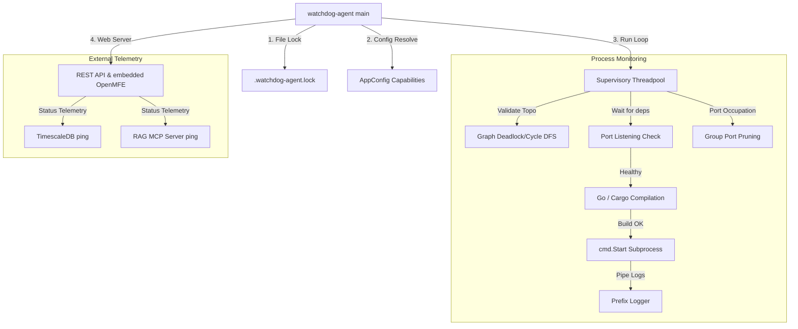

# 🏗️ Watchdog Agent — Architecture Overview

High-density structural map of the `watchdog-agent` process supervisor.

## Subsystem Architecture

The watchdog agent handles process management by walking configured dependencies, resolving target listening ports, compiling binaries, spawning child processes, and capturing and prefixing their logs. It also pings external components for ecosystem telemetry.



## Repository Anatomy

The repository follows a clean, modular package layout:

```text
watchdog-agent/
├── main.go            # Agent startup bootstrap and config capability resolution
├── go.mod             # Module dependencies
├── quick-overview/    # Technical behavior documentation playbooks
└── src/
    ├── config/        # Environment configurations and filesystem symlink healing
    ├── control/       # NATS control plane integrations
    ├── core/          # Telemetry status struct definitions
    ├── rest/          # HTTP REST endpoints, cache headers, and OpenMFE dashboard
    ├── server/        # Controller implementation (live pings and status aggregation)
    ├── supervisor/    # Supervisory loops, topological checks, and database launcher
    └── utils/         # Cross-platform single instance locks and group process killers
```
